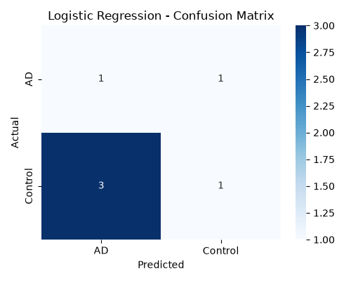
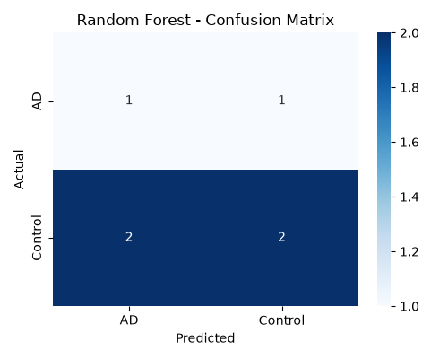
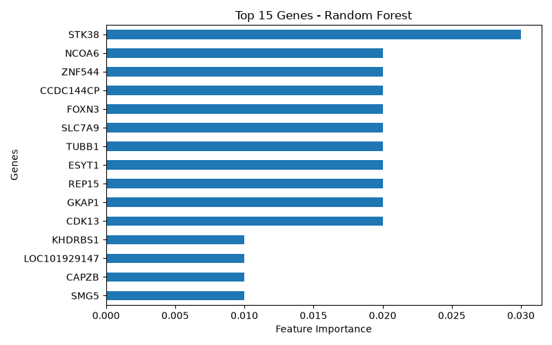
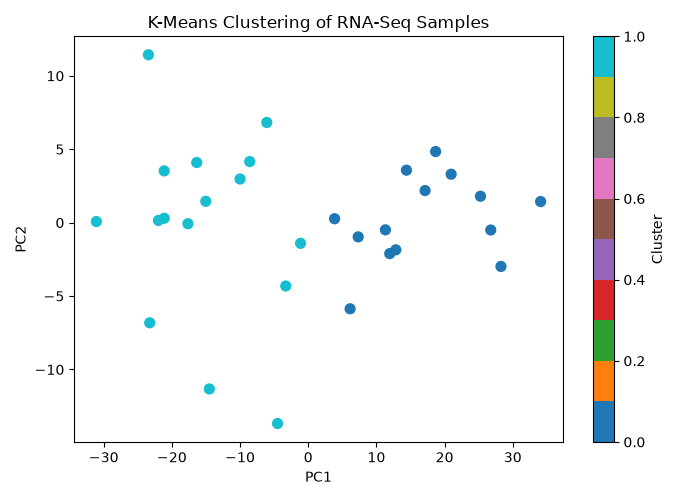

# RNA-Seq Machine Learning

RNA-seq data preprocessing, machine learning classification, feature analysis, and K-Means clustering of Alzheimer’s disease samples.

## Dataset
The dataset used in this project is **GSE159699** from the NCBI Gene Expression Omnibus (GEO).
The dataset contains RNA-seq expression data from human brain samples.

### Sample Groups
- Alzheimer's Disease (AD): 12 samples
- Control: 18 samples
  - Old control
  - Young control

The original dataset contains:
- 27,130 genes
- 30 samples

## Analysis Workflow
The following steps were performed:
1. RNA-seq count data loading
2. Gene expression filtering
3. CPM normalization
4. Log2 transformation
5. Train-test splitting
6. Feature selection
7. Standardization
8. Logistic Regression classification
9. Random Forest classification
10. Random Forest feature importance analysis
11. K-Means clustering
12. PCA visualization

## Machine Learning Models

### Logistic Regression
Used to classify samples into:
- AD
- Control

Accuracy obtained:
**33.33%**

### Random Forest
Used for classification and feature importance analysis.
Accuracy obtained:
**50.00%**

## Clustering
K-Means clustering was performed using two clusters.

### Silhouette Score
**0.3922**
The clusters showed substantial separation between AD and Control samples.

## Cluster vs Diagnosis
| Cluster | AD (%) | Control (%) |
|---|---:|---:|
| 0 | 78.57 | 21.43 |
| 1 | 6.25 | 93.75 |

## Top 15 Genes
The Random Forest model identified the following genes among the top features:
- STK38
- CDK13
- GKAP1
- REP15
- ESYT1
- FOXN3
- CCDC144CP
- SLC7A9
- ZNF544
- NCOA6
- TUBB1
- KHDRBS1
- SMG5
- CAPZB
- LOC101929147

## Results
### Logistic Regression Confusion Matrix

### Random Forest Confusion Matrix

### Random Forest Feature Importance

### K-Means PCA

## Technologies Used
- Python
- Pandas
- NumPy
- Scikit-learn
- Matplotlib
- Seaborn

## Note
The classification results are based on a small dataset containing only 30 samples, with 6 samples in the test set. Therefore, the reported test-set accuracies should be interpreted cautiously and are specific to this analysis.
